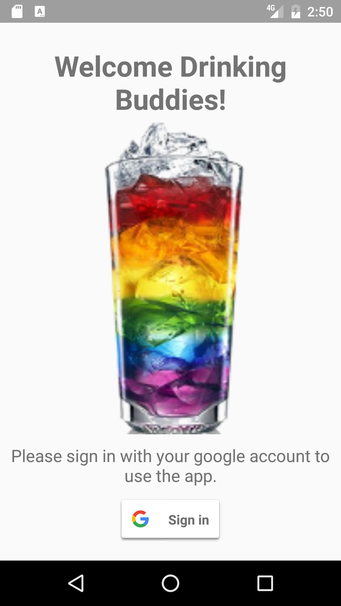
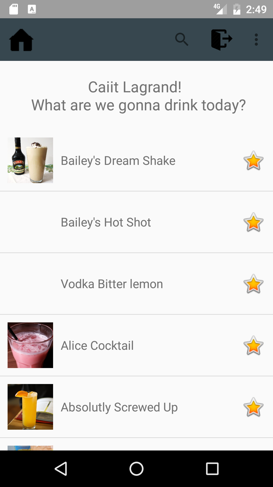
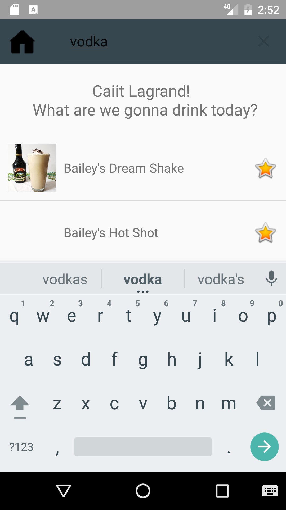
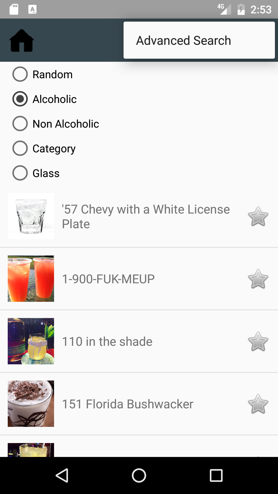
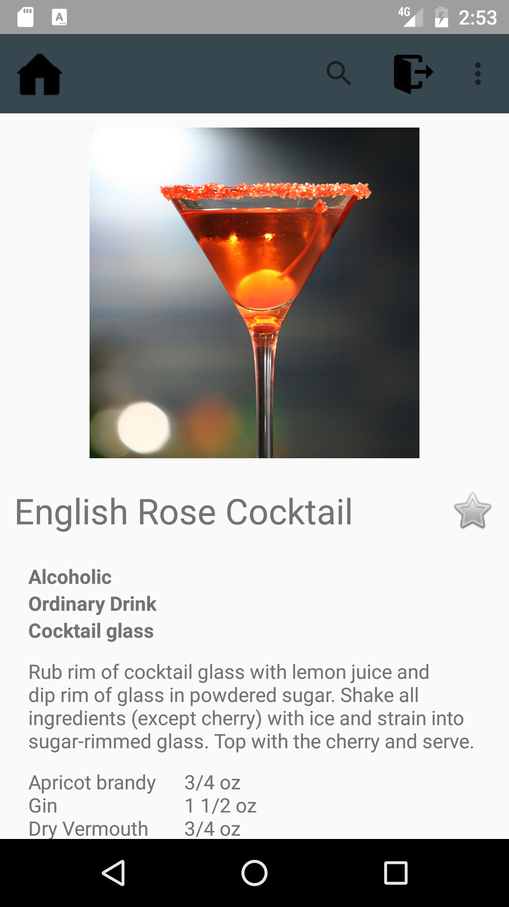

# Drinking Buddies
pset6 of Native App course: Build Your Own

This app uses http://www.thecocktaildb.com/ as API for searching cocktails and saving them to the users favourites list. The user needs to sign in with its google account to be able to use the app.

The main activity is the favourites list, which shows the drinks the user has liked. The user can like/dislike drinks by clicking on the star.

The user can search for cocktails using the searchbar in the toolbar, or the advanced search option that can be found in the options menu of the toolbar. 

By clicking on a drink all the information of that drink will be shown, including the ingredients and instructions how to make the drink.

